# System Architecture

This document provides a comprehensive overview of the Mahidol888 system architecture, covering the technical design, security layers, and data flow.

## High-Level Architecture

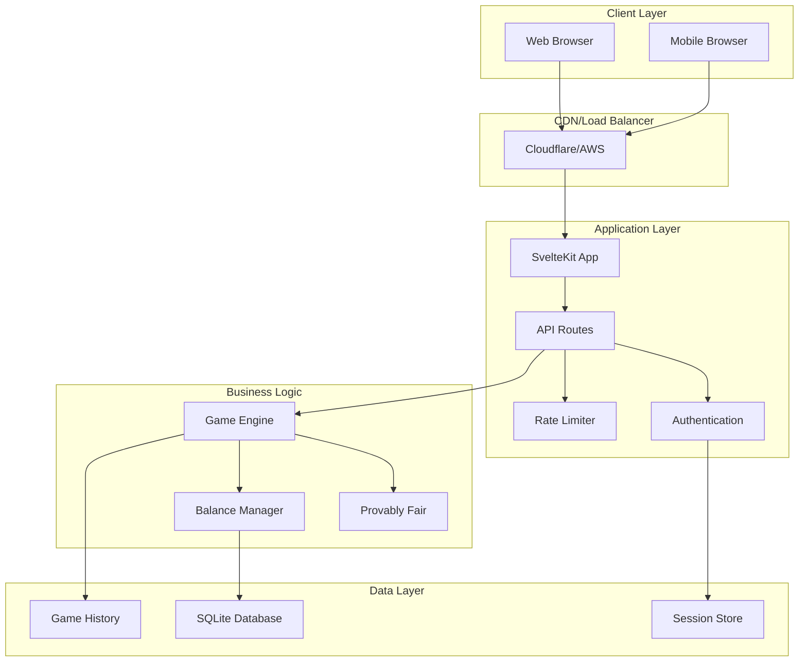

## Technology Stack

### Frontend Architecture

**Framework**: SvelteKit 2.0

- **Rendering**: Server-Side Rendering (SSR) + Client-Side Hydration
- **Routing**: File-based routing with layout system
- **State Management**: Svelte 5 runes (`$state`, `$derived`, `$effect`) with global stores
- **Styling**: TailwindCSS with custom component library
- **Type Safety**: TypeScript throughout

**Component Architecture**:

```
components/
├── ui/           # Generic UI components (buttons, inputs, etc.)
├── game/         # Game-specific components
├── self/         # Application-specific components
└── providers/    # State management providers
```

### State Management Architecture

**Global State Management**:

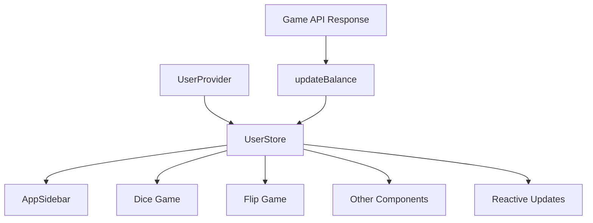

**Store Structure**:

```typescript
interface UserState {
  user: PublicUser | null;
  isLoading: boolean;
}

// Store methods
- setUser(user: PublicUser | null)
- updateBalance(newBalance: number)
- setLoading(isLoading: boolean)
- reset()
```

**Provider Pattern**:

- `UserProvider`: Initializes store with server data
- `userStore`: Global reactive state for user data
- Components subscribe to store for real-time updates

### Backend Architecture

**Runtime**: Node.js with SvelteKit API routes

- **Database**: SQLite with Drizzle ORM
- **Authentication**: Custom session-based system
- **Security**: Multi-layer protection system
- **Crypto**: Node.js crypto module for provably fair games

## Security Architecture

### Multi-Layer Security Model

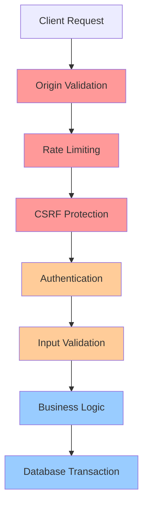

### Layer Descriptions

1. **Network Layer** (Red)
   - Origin validation
   - DDoS protection
   - HTTPS enforcement

2. **Application Layer** (Orange)
   - Session validation
   - Permission checks
   - Input sanitization

3. **Business Layer** (Blue)
   - Game integrity
   - Balance validation
   - Audit logging

## Authentication System

### Session Management Flow

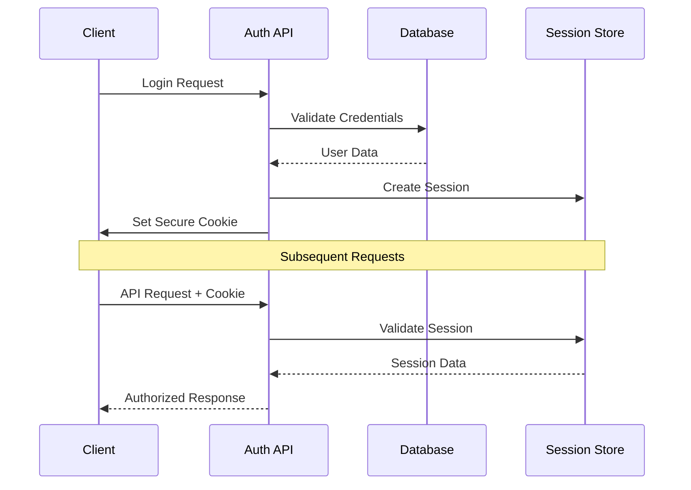

### Security Features

- **Argon2 Password Hashing**: Memory-hard algorithm resistant to brute force
- **Secure Session Cookies**: HttpOnly, Secure, SameSite attributes
- **Session Rotation**: Automatic renewal before expiration
- **IP Tracking**: Optional IP address validation

## Game System Architecture

### Provably Fair Implementation

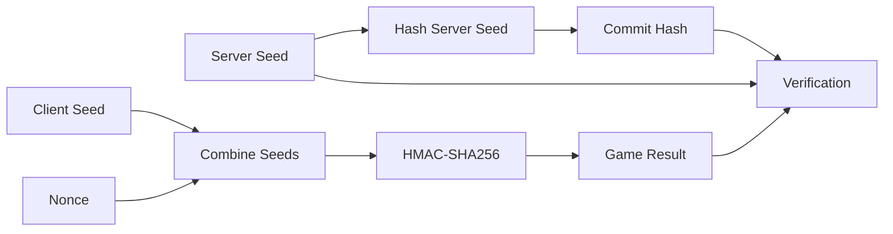

### Game Flow

1. **Pre-Game**: Server generates and hashes seed
2. **Bet Placement**: Client provides seed and bet parameters
3. **Result Generation**: HMAC-SHA256 calculation
4. **Post-Game**: All parameters stored for verification

### Balance Management

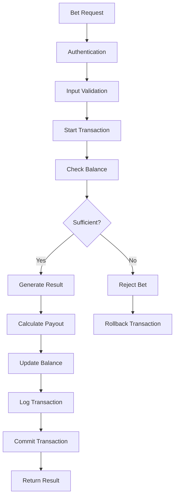

## Database Architecture

### Schema Design

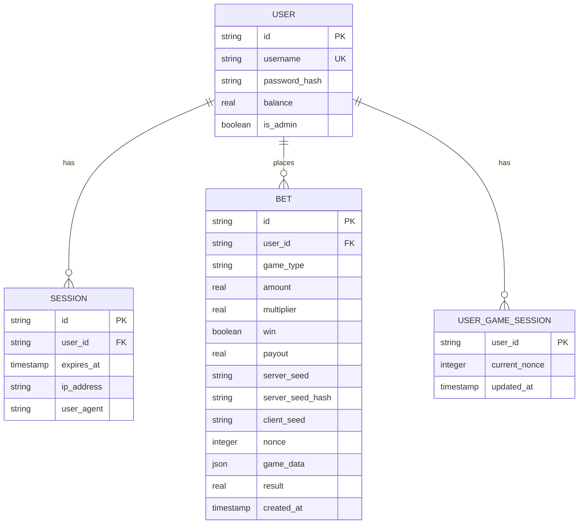

### Transaction Management

- **ACID Compliance**: Full transaction support
- **Concurrency Control**: Row-level locking for balance updates
- **Integrity Constraints**: Foreign keys and check constraints
- **Audit Trail**: Complete transaction history

## API Architecture

### RESTful Design

```
POST /api/auth              # Authentication
POST /api/auth/logout       # Logout
POST /api/game/dice         # Dice game bet
POST /api/game/flip         # Coin flip bet
GET  /api/game/history      # Bet history
GET  /api/game/verify       # Verify bet
GET  /api/csrf              # CSRF token
```

### Request/Response Format

**Request Format**:

```typescript
interface ApiRequest {
	// Game-specific parameters
	amount: number;
	gameType: 'dice' | 'flip';
	// ... other parameters
}
```

**Response Format**:

```typescript
interface ApiResponse<T> {
	success: boolean;
	result?: T;
	error?: string;
	timestamp?: string;
}
```

### Rate Limiting

**Configuration**:

- Authentication: 5 attempts per 15 minutes
- Gaming: 60 bets per minute per user (1 per second)
- General API: 100 requests per minute per IP

**Headers**:

```http
X-RateLimit-Limit: 60
X-RateLimit-Remaining: 45
X-RateLimit-Reset: 1640995200
```

## Performance Architecture

### Optimization Strategies

**Database Performance**:

- WAL mode for better concurrency
- Optimized pragma settings
- Efficient indexing strategy
- Connection pooling

**Frontend Performance**:

- Code splitting by route
- Component lazy loading
- Efficient state management
- Optimized bundle sizes

**Caching Strategy**:

- Browser caching for static assets
- API response caching where appropriate
- Client-side state caching

## Deployment Architecture

### Production Environment

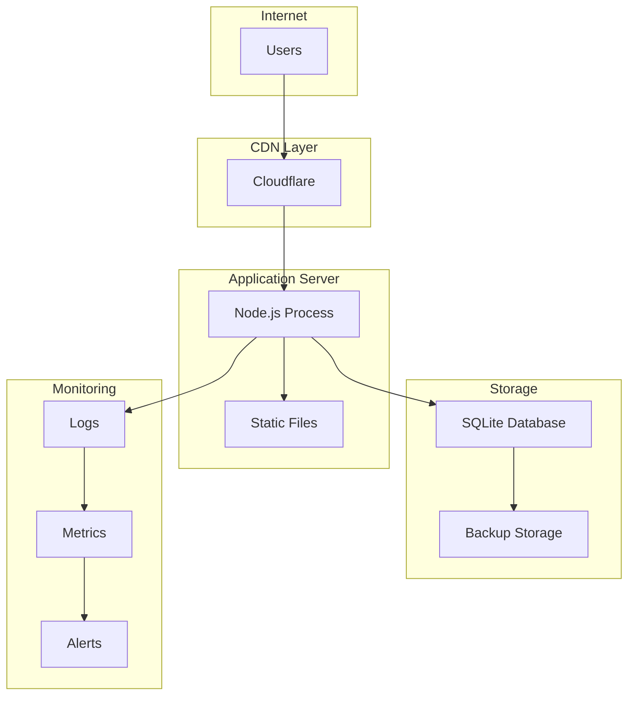

### Scaling Considerations

**Horizontal Scaling**:

- Stateless application design
- Session data in database
- Load balancer compatible

**Vertical Scaling**:

- Efficient memory usage
- CPU optimization
- Database performance tuning

## Security Architecture Details

### CSRF Protection

**Implementation**: Double Submit Cookie Pattern

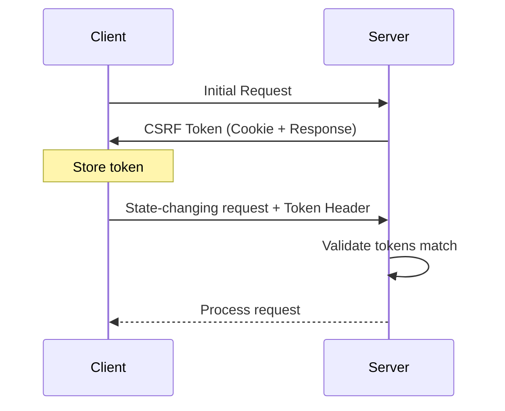

### Rate Limiting Architecture

**Storage**: In-memory with cleanup

```typescript
interface RateLimitEntry {
	count: number;
	resetTime: number;
}

// Storage: Map<string, RateLimitEntry>
// Key format: "identifier:windowMs:maxRequests"
```

### Input Validation Pipeline

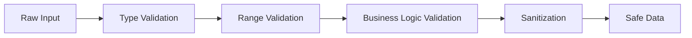

## Data Flow Architecture

### Game Betting Flow

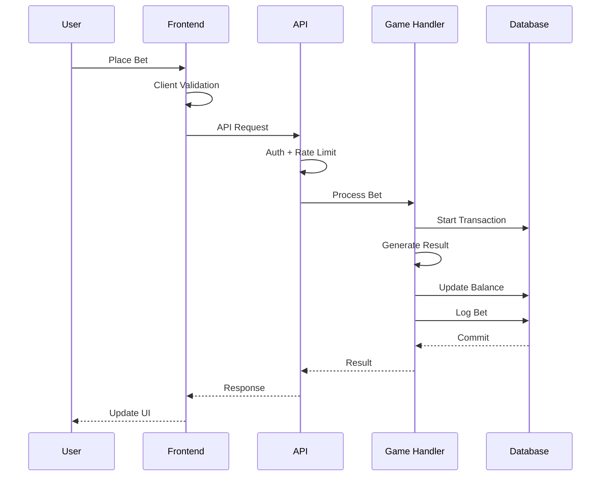

### Error Handling Flow

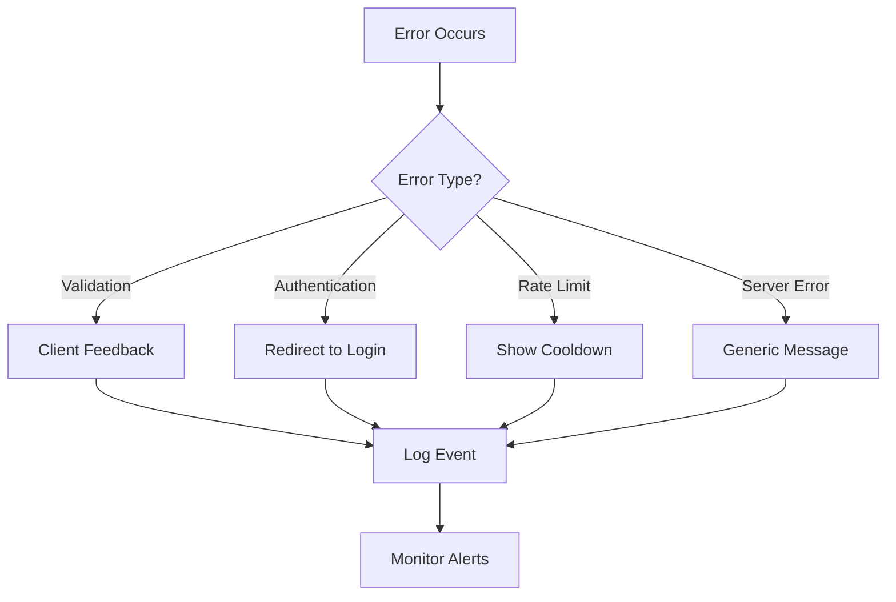

## Monitoring and Observability

### Logging Strategy

**Log Levels**:

- **Error**: System errors, security violations
- **Warn**: Failed login attempts, rate limiting
- **Info**: Successful operations, user actions
- **Debug**: Detailed debugging information (dev only)

**Log Format**:

```json
{
	"timestamp": "2024-01-01T00:00:00Z",
	"level": "info",
	"message": "User login successful",
	"userId": "user123",
	"ip": "192.168.1.1",
	"userAgent": "Mozilla/5.0..."
}
```

### Metrics Collection

**Key Metrics**:

- Request latency percentiles
- Error rates by endpoint
- Active user count
- Game participation rates
- Security incident frequency

### Health Checks

**Endpoints**:

- `/health` - Basic health check
- `/health/detailed` - Full system status
- `/health/database` - Database connectivity

## Development Architecture

### Local Development

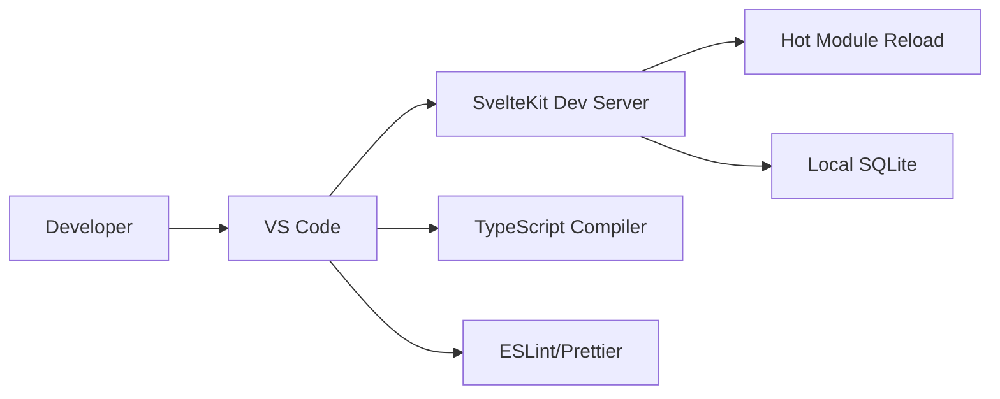

### CI/CD Pipeline

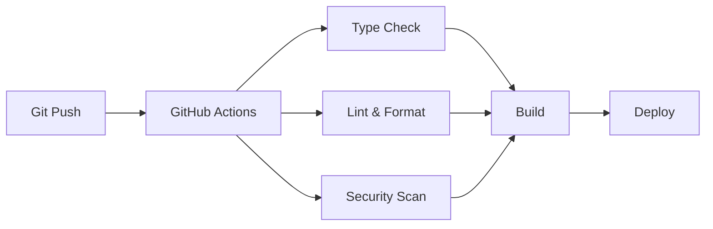

## Disaster Recovery

### Backup Strategy

**Database Backups**:

- Automated daily backups
- Point-in-time recovery capability
- Offsite backup storage

**Application Recovery**:

- Infrastructure as code
- Automated deployment scripts
- Health monitoring and alerts

### Business Continuity

**Service Availability**:

- Graceful degradation
- Maintenance mode capability
- Data integrity protection

## Future Architecture Considerations

### Scalability Improvements

**Potential Enhancements**:

- Redis for session storage
- Database sharding for user data
- CDN for dynamic content
- Microservices for game logic

**Performance Optimizations**:

- Database read replicas
- Caching layers
- Background job processing

### Security Enhancements

**Advanced Features**:

- Web Application Firewall (WAF)
- Advanced fraud detection
- Multi-factor authentication
- Encrypted database at rest

## Leaderboard System

### Overview

The leaderboard system provides competitive rankings for players based on various performance metrics. It encourages engagement through gamification while maintaining transparency and fairness.

### Features

**Ranking Metrics**:
- Total Wagered: Sum of all bet amounts
- Total Profit: Net profit/loss across all games
- Biggest Win: Largest single payout
- Win Rate: Percentage of winning bets

**Filtering Options**:
- Time-based filtering (All time, 24h, 7d, 30d)
- Metric-based sorting
- Pagination for performance

### API Endpoints

**GET /api/leaderboard**
- Query parameters: page, limit, timeframe, metric
- Returns paginated leaderboard data with rankings
- Requires minimum 5 bets to appear on leaderboard

### Database Design

The leaderboard leverages existing bet and user tables through aggregated queries:
- Real-time calculation (no separate leaderboard table)
- Uses SQL aggregation functions for performance
- Filters users with insufficient activity (< 5 bets)

### Performance Optimizations

- Pagination to limit response size
- Indexed queries on bet.userId and bet.createdAt
- Rounded monetary values to prevent precision issues
- Caching potential for high-traffic scenarios

### Security Considerations

- No sensitive user data exposed
- Rate limiting on API endpoints
- Parameterized queries prevent SQL injection
- Time-based filtering prevents excessive data exposure

### Frontend Implementation

**Components**:
- Responsive table design with modern UI
- Real-time filtering and sorting
- Loading states and error handling
- Mobile-optimized pagination
- Multi-language support (EN/TH)

**User Experience**:
- Clean, minimal design without "AI slop"
- Intuitive filtering controls
- Visual ranking indicators (trophies for top 3)
- Profit/loss indicators with color coding
- Professional table styling with hover effects

This architecture provides a solid foundation for a secure, scalable gambling platform while maintaining simplicity and clarity in the codebase.
