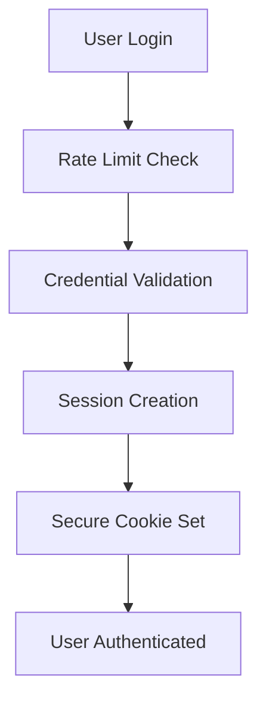
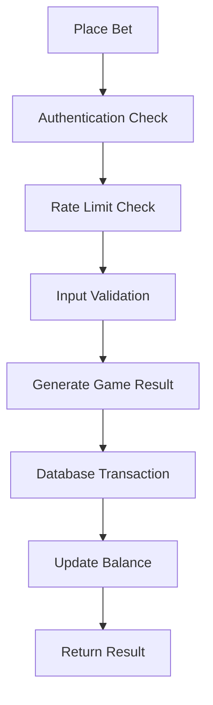
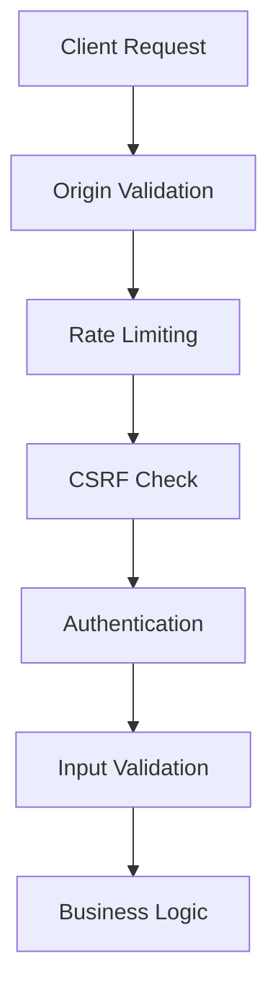

# Project Overview

Welcome to Mahidol888! This document provides a comprehensive overview of the project architecture, technology stack, and core concepts.

## What is Mahidol888?

Mahidol888 is a secure, provably fair gambling platform built with modern web technologies. It features:

- **Provably Fair Games**: Dice rolling and coin flip games with cryptographic verification
- **Enterprise Security**: Multi-layer security with rate limiting, CSRF protection, and secure sessions
- **Real-time Gaming**: Smooth animations and instant feedback
- **International Support**: Multi-language interface (English/Thai)

## Technology Stack

### Frontend

- **SvelteKit 2.0**: Full-stack framework with SSR and routing
- **TypeScript**: Type safety and enhanced developer experience
- **TailwindCSS**: Utility-first styling framework
- **Lucide Icons**: Clean, consistent iconography

### Backend

- **SvelteKit API Routes**: Server-side API endpoints
- **SQLite + Drizzle ORM**: Database with type-safe queries
- **Node.js Crypto**: Cryptographic operations for provably fair games

### Security

- **Argon2**: Password hashing
- **CSRF Protection**: Double-submit cookie pattern
- **Rate Limiting**: Multi-tier abuse prevention
- **Session Management**: Secure cookie-based sessions

### Development Tools

- **Bun**: Fast JavaScript runtime and package manager
- **ESLint + Prettier**: Code quality and formatting
- **Drizzle Studio**: Database management interface

## Project Structure

```
mahidol888/
├── src/
│   ├── lib/
│   │   ├── components/          # Reusable UI components
│   │   │   ├── game/           # Game-specific components
│   │   │   ├── self/           # App-specific components
│   │   │   └── ui/             # Generic UI library
│   │   ├── server/             # Server-side utilities
│   │   │   ├── auth.ts         # Authentication system
│   │   │   ├── csrf.ts         # CSRF protection
│   │   │   ├── db/             # Database layer
│   │   │   ├── errors.ts       # Error handling
│   │   │   ├── game-handler.ts # Shared game logic
│   │   │   ├── provably-fair.ts # Gaming algorithms
│   │   │   └── rate-limiter.ts # Rate limiting
│   │   ├── types/              # TypeScript definitions
│   │   └── utils/              # Client-side utilities
│   ├── routes/
│   │   │── game/           # Game pages
│   │   └── api/                # API endpoints
│   └── static/                 # Static assets
├── docs/                       # Documentation
├── drizzle/                    # Database migrations
└── messages/                   # Internationalization
```

## Core Architecture

### 1. Authentication System



**Key Features:**

- Argon2 password hashing
- Session-based authentication
- Secure cookie configuration
- Timing attack protection

### 2. Game System



**Key Features:**

- Provably fair algorithms
- Database transactions for balance safety
- Shared game handler to reduce duplication
- Complete audit trail

### 3. Security Layers



## Data Models

### User System

```typescript
interface User {
	id: string; // Unique user identifier
	username: string; // Login username
	passwordHash: string; // Argon2 hashed password
	balance: number; // Current balance
	isAdmin: boolean; // Admin privileges
}

interface Session {
	id: string; // Session identifier
	userId: string; // Associated user
	expiresAt: Date; // Expiration time
	ipAddress: string; // Client IP (optional)
	userAgent: string; // Client browser (optional)
}
```

### Gaming System

```typescript
interface Bet {
	id: string; // Unique bet identifier
	userId: string; // Player who placed bet
	gameType: 'dice' | 'flip';
	amount: number; // Bet amount
	multiplier: number; // Winning multiplier
	win: boolean; // Bet outcome
	payout: number; // Amount won (if any)

	// Provably Fair Data
	serverSeed: string; // Server-generated seed
	serverSeedHash: string; // Hash of server seed
	clientSeed: string; // Client-provided seed
	nonce: number; // Sequential number

	// Game Data
	gameData: object; // Game-specific parameters
	result: number; // Game result value
	createdAt: Date; // Timestamp
}
```

## Security Architecture

### Multi-Layer Protection

1. **Network Layer**
   - Origin validation
   - HTTPS enforcement (production)
   - Rate limiting by IP

2. **Application Layer**
   - CSRF token validation
   - Authentication checks
   - Input validation

3. **Business Logic Layer**
   - Balance validation
   - Game integrity checks
   - Audit logging

4. **Database Layer**
   - Transaction isolation
   - Foreign key constraints
   - Data integrity checks

### Provably Fair Gaming

The platform implements cryptographically secure gaming:

```typescript
// Game result generation
function generateGameResult(serverSeed: string, clientSeed: string, nonce: number): number {
	const hmac = createHmac('sha256', serverSeed);
	hmac.update(`${clientSeed}-${nonce}`);
	const hash = hmac.digest('hex');
	return (parseInt(hash.substring(0, 8), 16) % 10000) / 100;
}
```

**Verification Process:**

1. Server generates and hashes seed before game
2. Client provides seed (or auto-generated)
3. Game result calculated using HMAC-SHA256
4. All parameters stored for later verification
5. Players can verify any bet result

## API Design

### RESTful Endpoints

- `POST /api/auth` - Login/Register
- `POST /api/auth/logout` - Logout
- `POST /api/game/dice` - Place dice bet
- `POST /api/game/flip` - Place coin flip bet
- `GET /api/game/history` - Get bet history
- `GET /api/game/verify` - Verify bet result

### Response Format

```typescript
interface ApiResponse<T> {
	success: boolean;
	result?: T; // Success data
	data?: T; // Alternative success data
	error?: string; // Error message
	timestamp?: string; // Response timestamp
}
```

### Rate Limiting Headers

```http
X-RateLimit-Limit: 10
X-RateLimit-Remaining: 7
X-RateLimit-Reset: 1640995200
```

## Component Architecture

### Game Components

```
game/
├── dice/
│   ├── DiceControls.svelte    # Bet controls
│   ├── DiceSlider.svelte      # Target selection
│   └── FloatingDice.svelte    # Animation
├── flip/
│   ├── CoinDisplay.svelte     # Coin animation
│   └── CoinSelector.svelte    # Side selection
├── BetAmountInput.svelte      # Amount input
├── GameHistory.svelte         # Bet history
├── GameModeToggle.svelte      # Manual/Auto mode
└── ProfitDisplay.svelte       # Profit calculation
```

### UI Component Library

- **Atomic Design**: Atoms → Molecules → Organisms
- **Consistent Styling**: TailwindCSS utility classes
- **TypeScript Props**: Fully typed component interfaces
- **Accessibility**: ARIA labels and keyboard navigation

## Development Workflow

### Feature Development

1. **Planning**: Design new features with security in mind
2. **Implementation**: Follow coding standards and patterns
3. **Testing**: Validate functionality and security
4. **Review**: Code review focusing on security and performance
5. **Documentation**: Update relevant documentation

### Security-First Development

- Input validation on client AND server
- Use shared handlers for consistent security
- Test rate limiting and authentication flows
- Validate all database operations
- Sanitize error messages

## Performance Considerations

### Database Optimization

- SQLite WAL mode for better concurrency
- Proper indexing on frequently queried columns
- Database transactions for data consistency
- Connection pooling for production

### Frontend Performance

- Component lazy loading
- Efficient state management
- Optimized bundle sizes
- Image optimization

## Monitoring and Observability

### Logging Strategy

- **Error Logging**: All errors with context
- **Security Events**: Authentication, rate limiting
- **Game Events**: All bets and outcomes
- **Performance Metrics**: Response times, error rates

### Key Metrics

- User registration/login rates
- Game participation metrics
- Error rates by endpoint
- Security incident frequency

## Next Steps

Now that you understand the project structure, continue with:

1. [Development Setup](./development-setup.md) - Set up your environment
2. [Coding Standards](../development/coding-standards.md) - Learn our conventions
3. [Security Guidelines](../development/security-guidelines.md) - Understand security requirements
4. [First Contribution](./first-contribution.md) - Make your first change

## Questions?

- **Architecture Questions**: Review [System Architecture](../architecture/system-architecture.md)
- **Security Questions**: See [Security Guidelines](../development/security-guidelines.md)
- **Database Questions**: Check [Database Design](../architecture/database-design.md)
